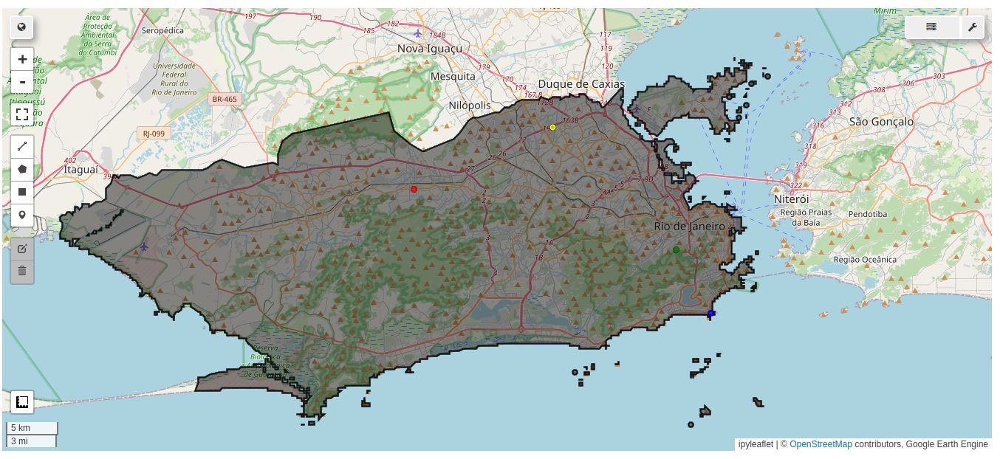
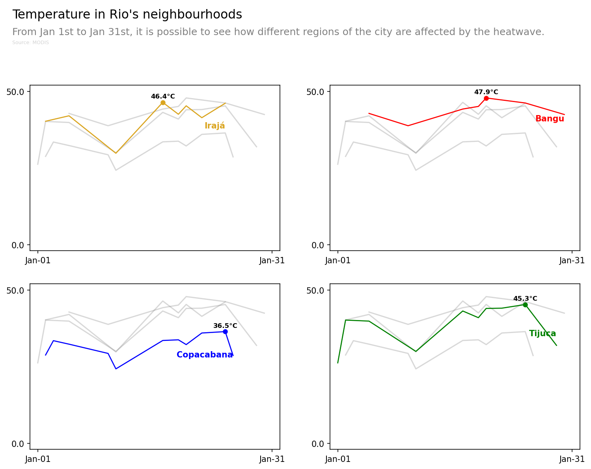

# Evaluating Land Temperature in Rio with MODIS 

- Tools: 
    - Python
    - GEE (Python API)

## Goals

- Technical:
    - improve skills with GEE Python API since it is slightly different from Javascript, which is the one I am more used to.
    - learn how to create more appealing plots by following [Python Graph Gallery](https://python-graph-gallery.com/) tutorials

- Analytical:
    - evaluate how different neighborhoods in Rio suffered from the heatwaves that occured in January 2025.

## Results

2025 Summer was one of the hottest and driest in Rio de Janeiro. It was also the first time city hall's Heat Index (Nível de Calor - NC) reached scaled 4 out of 5 since its creation. NC4 means that the temperature was between 40°C and 44°C for at least 3 stright days.

From the chosen neighborhoods, two of them are located in areas to be known as the hottest by its residents: Bangu and Irajá. These locations are characterized by high urban density, low amount of vegetation density, located within mountains that block seabreeze, and both of them are far from the shoreline.

Tijuca was the 3rd hottest area. This neighborhood area also share a couple of characteristics as the ones before, however, it is located closer to Tijuca National Park. First, it was thought that the proximity to the park would bring temperature relief, however, the data still shows high temperatures. 

Finally, Copacabana. This neighborhood is located in the southern zone, by the sea. Despite having a high urban density, it also have a considerable amount of mountains with dense vegetation. The proximity to the ocean surely impacts on the thermal confort of this area. 

The difference between Tijuca and Copacabana is 8.8°C. When we compare with the hottest neighborhood chosen, Irajá, this difference goes to 13.3°C. 