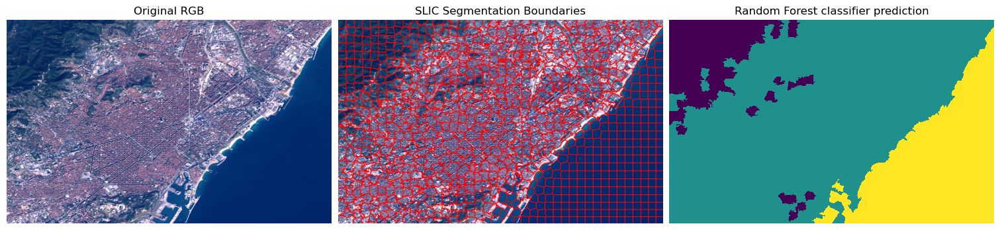
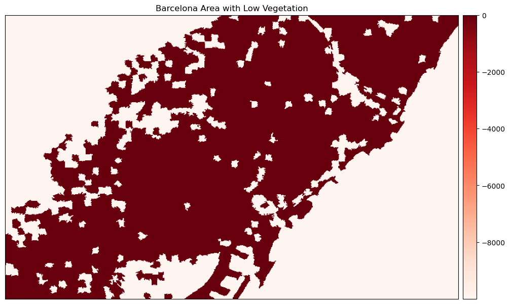
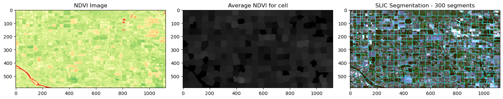
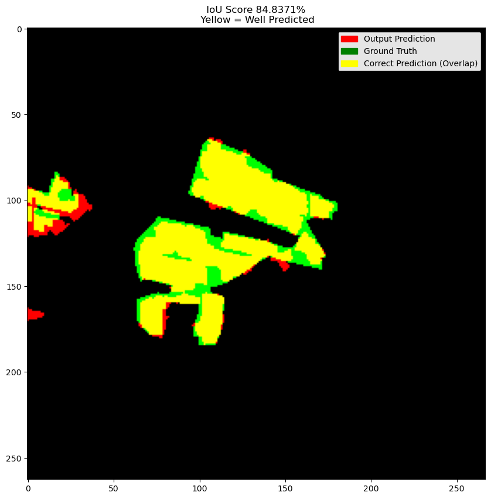

# Object Based Image Analysis 

This repository is based in the OBIA Tutorial Developed by [@mariarodriguezn](https://github.com/mariarodriguezn/obia_tutorials/tree/main). In here, I go through several OBIA concepts in order to test and practice this methodology. 

In addition, I also present a project using OBIA and other technologies (Xarray, STAC, QGIS), and methodologies (Machine Learning, Band Composition, Image Analysis).

It is covered: 

- Image Classification

- Feature Extraction

- Image Segmentation

- Final Project

In this project, I bring together various skills, technologies and methodologies to test the speed and efficiency of combining Machine Learning and OBIA.

The photovoltaic plant near El Judio, Andalusia, Spain, was chosen as the study area.

Satellite images were collected from the Sentinel-2 catalog via STAC in the Python environment. I then generated a datacube with the desired bands.

Subsequently, I generated compositions of bands that provide relevant information for delimiting the solar panels from the rest of the vegetation. I then added these compositions to the cube, before moving on to image segmentation and classification.

To carry out the segmentation, I used skimage and collected the samples in the Jupyter notebook environment itself, using the leafmap to display the segments. I then used the RandomForest algorithm to train with the selected samples and finally tested on the entire image.

The IoU was used as a metric for validation. To aid visual inspection of the result in relation to the ground truth - which was taken from the Open Street Map data - I generated an RGB composite where the predicted data was in the red band, followed by the ground truth in green and the blue channel was left empty. The areas that were correctly predicted

Areas that have been correctly predicted have a yellow color, the result of the sum of red and green. Where it is only red, it means that it was incorrectly predicted; and where it is only green, it indicates that it was incorrectly predicted.

It is worth noting that, as this project dealt with super cells, some may contain information other than vegetation and solar panels. This small difference can generate a buffer in relation to the ground truth.

Even so, the final result of 84.84% IoU, taking into account the rapid implementation and this limitation of the methodology due to the super cells, shows that in a scenario where you don't have a lot of time or computing power, it can be a good approach to image classification.

