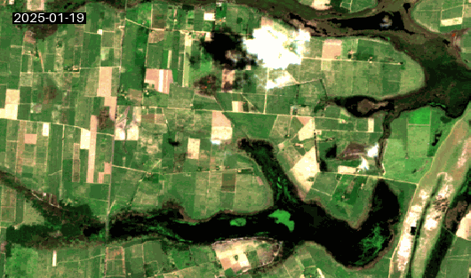

# STAC API Project Setup Guide

This repository contains tools and notebooks for working with STAC (SpatioTemporal Asset Catalog) API to access and analyze satellite data.



## Environment Setup with UV

UV is a modern Python packaging tool that offers faster dependency resolution and installation compared to pip. Here's how to set up your environment:

### 1. Install UV

#### For Linux/macOS:
```bash
curl -LsSf https://astral.sh/uv/install.sh | sh
```

#### For Windows:
Download and install from the [official UV installation guide](https://docs.astral.sh/uv/getting-started/installation/#__tabbed_1_2)

### 2. Create Virtual Environment

```bash
uv venv
```

### 3. Activate Virtual Environment

#### For Linux/macOS:
```bash
source .venv/bin/activate
```

#### For Windows:
```bash
.venv\Scripts\activate
```

### 4. Install Dependencies

```bash
uv sync
```

### 5. Lock Dependencies (for reproducibility)

```bash
uv lock
```


## Troubleshooting

If you encounter any issues with Jupyter kernel recognition in VSCode:

1. Ensure your virtual environment is activated
2. Install ipykernel:
   ```bash
   uv add install ipykernel
   ```


## Project Structure

- `agriculture_stac.ipynb`: Notebook for agricultural analysis using STAC
- `stac.ipynb`: General STAC API usage examples
- `utils/`: Utility functions for image processing
- `assets/`: Contains geojson files and output images

## Notes

- Always ensure your virtual environment is activated before running notebooks
- Use `uv pip install` instead of regular `pip install` for better dependency management
- The `uv.lock` file ensures reproducible environments across different machines