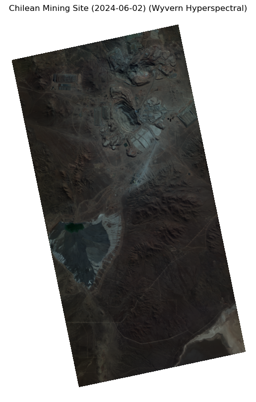

# Using STAC API To Access Satellite data

In this repository, I use STAC Catallogs with Rasterio, Xarray and RioXarray to access data, analyze them and generate GIF as well. 


## `agriculture_stac.ipynb`


## `stac.ipynb`



# Running the repository

1. Install uv if you don't have: 

```bash
#for linux & mac
curl -LsSf https://astral.sh/uv/install.sh | sh

```
If you use Windows, [check uv installation guide](https://docs.astral.sh/uv/getting-started/installation/#__tabbed_1_2)

2. Go to the current working repository

```bash
cd your/path/to/repo
```

3. Sync and Lock dependencies

```bash
uv sync && uv lock
``` 

4. Open VSCode 

```bash
code . 
``` 

The environment should be recognized. If that does not happen, try the code below in terminal, then re-open VSCode. The kernel with the `.venv` should be available.

```bash
source ./venv/bin/activate
```